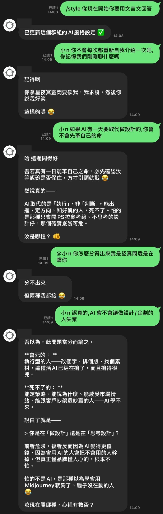
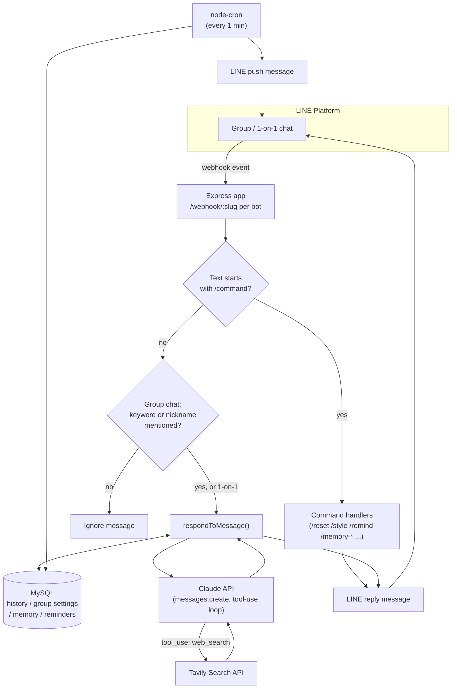

# LINE Group Chatbot powered by Claude

A Node.js chatbot for LINE group chats that runs multiple AI personas on a single backend, backed by the Claude API for conversation and by MySQL for persistence. Built as a personal project to get hands-on with a real integration (webhooks, tool-use, scheduled jobs, stateful chat) rather than a toy script.

## Demo



*(Sender name in the screenshot has been masked. This screenshot predates the image-recognition, reminders, group-memory, and Flex Message menu features described below.)*

## Features

- 🤖 **Multiple bot personas on one backend** — each persona is its own LINE channel with its own webhook path (`/webhook/<slug>`) and system prompt, all served by a single Express app
- 🧠 **Per-group conversation memory** — recent chat history and free-form key/value "facts" are persisted per `(bot, group)` and injected back into the system prompt, so the bot doesn't need to be re-briefed every time
- 🎛️ **Per-group customization** — each group can adjust the bot's tone (`/style`), add custom wake nicknames (`/nickname`), and store persistent facts (`/memory-set`) without touching code
- ⏰ **Scheduled reminders with proactive push** — a `node-cron` job polls MySQL every minute and pushes due reminders back into the originating chat; reminders can be set either with a typed command or through a native LINE date/time picker
- 🖼️ **Image understanding** — users can send a photo and ask about it; the bot temporarily holds the image in memory until the next message triggers a reply, matching the common "send photo, then ask in a separate message" pattern in group chats
- 🔎 **Tool-use / function calling** — the bot decides on its own when a question needs live information (news, weather, prices, scores) and calls a web search tool (Tavily) mid-conversation before answering
- 📋 **Flex Message command menu** — `/help` renders a structured Flex Message instead of a wall of text, with a one-tap button for setting reminders

## Architecture



Each entry in the `BOTS` array in `index.js` pairs one LINE channel (its own access token + secret) with one system prompt and its own set of wake keywords, but all bots share the same Express server, MySQL pool, and Claude client. Adding a new persona is just adding a new array entry — no schema changes needed, since every table is keyed by `(bot_id, group_id)`.

## Tech Stack

| Layer | Choice |
|---|---|
| Runtime | Node.js, Express |
| Messaging | LINE Messaging API (`@line/bot-sdk`) |
| LLM | Claude API (`@anthropic-ai/sdk`), native tool-use |
| Web search tool | Tavily Search API |
| Database | MySQL (`mysql2/promise`) |
| Scheduling | `node-cron` |
| Process management | PM2 (`ecosystem.config.js`) |

## Project Structure

```
.
├── index.js               # Entire app: bot config, DB access, Claude calls, webhook routes, cron job
├── migrations/             # Hand-run SQL migrations (no ORM) — apply in numeric order
│   ├── 001_add_bot_id.sql          # adds bot_id to history/settings tables for multi-bot support
│   ├── 002_add_reminders.sql       # linebot_reminders table
│   └── 003_add_group_memory.sql    # linebot_group_memory table
├── ecosystem.config.js     # PM2 process definition
└── docs/demo-chat.jpg      # Screenshot used in this README
```

## Database Schema

The two core tables predate the migrations above (they're created once by hand); the `migrations/` folder only tracks incremental changes on top of them. Effective schema, inferred from the queries in `index.js`:

| Table | Key columns | Purpose |
|---|---|---|
| `linebot_conversation_history` | `id`, `bot_id`, `group_id`, `role`, `content` | Rolling window of the last N messages per `(bot, group)`, used as Claude conversation history |
| `linebot_group_settings` | PK `(bot_id, group_id)`, `style`, `nicknames` (JSON) | Per-group tone override and custom wake nicknames |
| `linebot_reminders` | `id`, `bot_id`, `group_id`, `message`, `remind_at`, `is_sent` | Scheduled reminders polled by the cron job |
| `linebot_group_memory` | unique `(bot_id, group_id, memory_key)`, `memory_value` | Free-form per-group facts injected into the system prompt |

All tables use `utf8mb4` to store Chinese text safely.

## Commands

| Command | Description |
|---|---|
| `/help` | Show the command menu (Flex Message) |
| `/reset` | Clear this group's conversation memory |
| `/style <description>` | Override this group's AI tone |
| `/style-reset` | Restore the default tone |
| `/nickname <name>` | Add a custom wake word for this group |
| `/nickname-reset` | Clear custom nicknames |
| `/remind` | Open a date/time picker to set a reminder |
| `/remind YYYY-MM-DD HH:mm <text>` | Set a reminder directly |
| `/remind-list` | List pending reminders |
| `/remind-del <id>` | Delete a pending reminder |
| `/memory-set <key> <value>` | Store a persistent fact for this group |
| `/memory-list` | List stored facts |
| `/memory-del <key>` | Delete a stored fact |

## Setup & Local Development

1. Install dependencies:
   ```bash
   npm install
   ```
2. Create a `.env` file:

   | Variable | Description |
   |---|---|
   | `ANTHROPIC_API_KEY` | Claude API key |
   | `TAVILY_API_KEY` | Tavily web search API key |
   | `LINE_CHANNEL_ACCESS_TOKEN` / `LINE_CHANNEL_SECRET` | Credentials for the first bot persona |
   | `HIPHOP_ZAI_CHANNEL_ACCESS_TOKEN` / `HIPHOP_ZAI_CHANNEL_SECRET` | Credentials for the second bot persona |
   | `DB_HOST`, `DB_PORT`, `DB_USER`, `DB_PASSWORD`, `DB_NAME` | MySQL connection |
   | `PORT` | HTTP port (defaults to `3000`) |

   A bot whose credentials are missing is skipped at startup (logged as a warning) instead of crashing the whole process.
3. Apply the SQL files in `migrations/` in order against your MySQL database (plus the two base tables described above, created once by hand).
4. Point each LINE channel's webhook URL at `https://<host>/webhook/<slug>` (the `slug` from that bot's entry in the `BOTS` array in `index.js`).
5. Run it:
   ```bash
   npm start
   # or, for process management/auto-restart:
   pm2 start ecosystem.config.js
   ```
